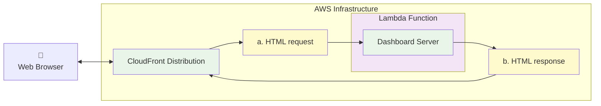
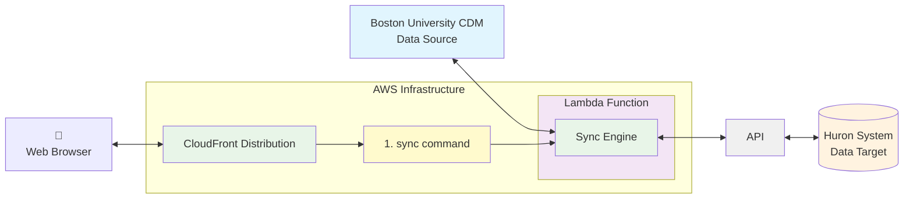

# Dashboard for Person Sync - BU CDM - Huron Integration

A serverless dashboard for managing integration operations between BU CDM and Huron systems, featuring inline assets and CloudFront origin verification for secure, self-contained deployment.

## Architecture

- **Lambda Function**: Serverless backend with multiple route handlers and built-in security
- **CloudFront Distribution**: Global CDN with origin verification for secure access
- **Mustache Templates**: Server-side templating with minified inline assets
- **Express Wrapper**: Local development server that mimics Lambda behavior
- **Bootstrap UI**: Responsive dashboard with tabbed interface
- **Template Build Pipeline**: Automated CSS/JS minification and template generation

### The lambda function doubles as a web server and a data synchronization engine:

**Lambda Function as HTML Dashboard Server:**



**Lambda Function as Data Sync Engine:**



## Features

- **Individual Person Sync**: Look up and synchronize individual person records
- **Bulk Operations**: Manage large-scale data synchronization jobs
- **Activity History**: View logs and history of integration activities
- **System Status**: Monitor health of connected services
- **Inline Assets**: CSS and JavaScript embedded directly in HTML for optimal performance
- **Origin Verification**: Secure access control restricting direct Lambda URL access

## Development

### Prerequisites

- Node.js 18+
- npm or yarn  
- AWS CLI configured (for production deployment)
- AWS CDK v2

### Local Development

```bash
# Install dependencies
npm install

# Start local development server with hot reload
npm run dev

# Watch mode for development
npm run dev:watch

# Dashboard available at:
# http://localhost:3000/dashboard
```

### Deployment Process

Use the following commands to build and deploy the application:

```bash
# Full deployment (create cloud resources)
npm run deploy
```

### API Endpoints

- `GET /dashboard` - Main dashboard interface with inline assets
- `POST /api/person-lookup` - Look up individual person by BUID or HRN
- `POST /api/person-sync` - Sync individual person record
- `POST /api/bulk-sync` - Start bulk synchronization operation
- `GET /api/history` - Get activity history and logs
- `GET /api/status` - Get system health status and metrics

### Deployment

The application is deployed using AWS CDK with CloudFront distribution:

```bash
# Deploy full stack to AWS
npm run deploy

# Synthesize CloudFormation template
npm run synth

# Destroy the stack
npm run teardown
```

### Security Features

**Origin Verification**: The Lambda Function URL includes built-in security that:
- Generates a cryptographically secure secret header
- Stores the secret in AWS Systems Manager Parameter Store
- Configures CloudFront to include the secret in all origin requests
- Validates requests and blocks direct Lambda URL access (returns 403)
- Logs security events for monitoring

**Template Security**: 
- CSS/JS assets are minified and embedded inline to prevent external requests
- No static file serving reduces attack surface
- Content Security Policy friendly architecture

### Environment Variables

- `NODE_ENV` - Set to 'development' for local mode
- `PORT` - Local server port (default: 3000)
- `ORIGIN_VERIFY_SECRET` - CloudFront origin verification secret (auto-generated)
- `LOCALHOST_WITH_MOCKS` - Enable mock services for local development

## Integration Dependencies

This project integrates with:
- `integration-core` - Core integration utilities and delta processing
- `integration-huron-person` - Huron-specific person synchronization logic

Note: In local development mode, mock implementations are used for these dependencies to enable standalone testing.

## Authentication & Access Control

**Production Security**:
- CloudFront distribution handles global edge caching
- Origin verification prevents direct Lambda Function URL access
- Secure header validation with logged security events
- Integration with SAML/OIDC identity providers (when configured)

**Local Development**:
- Runs without authentication for ease of testing
- Origin verification bypassed in development mode
- Mock authentication services available

